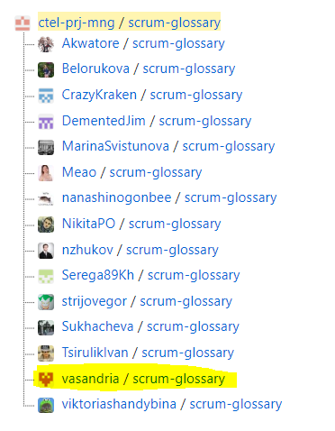

# lr10UPP

## Запросить у преподавателя доступ к репозиторию https://github.com/ctel-prj-mng/scrum-glossary и убедиться, что есть права на чтение и запись в репозиторий. 
Добавить ссылку на свой логин (сделать ссылкой) в файле README.md.
Разобраться с технологией shower.js (http://shwr.me/) и сделав локальную копию репозитория (scrum-glossary) на локальном компьютере (git checkout), создать собственный слайд, посвященный одному из термином методологии SCRUM.

